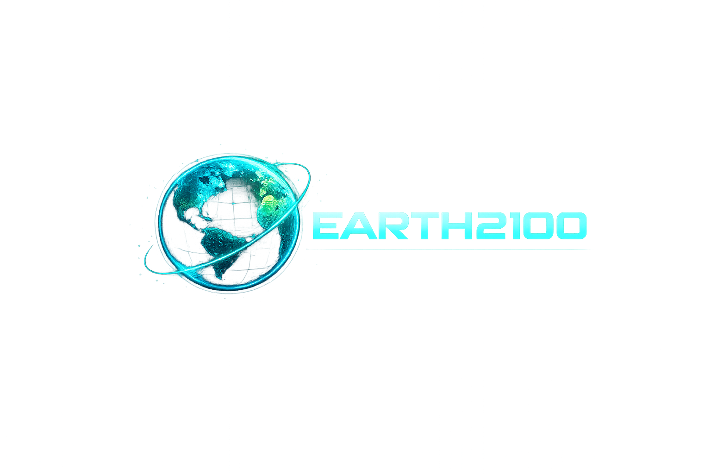
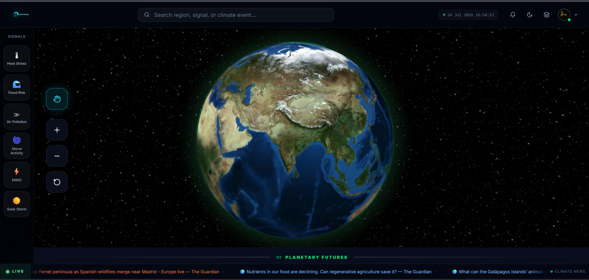
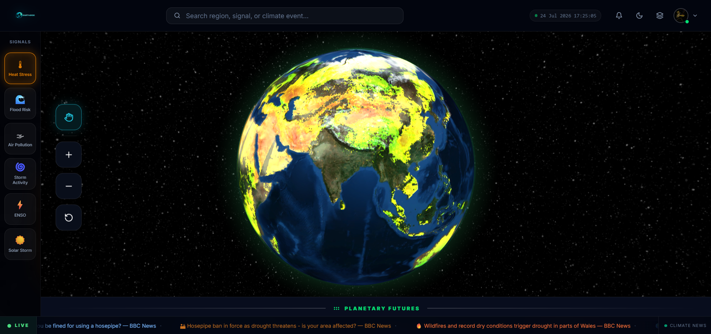
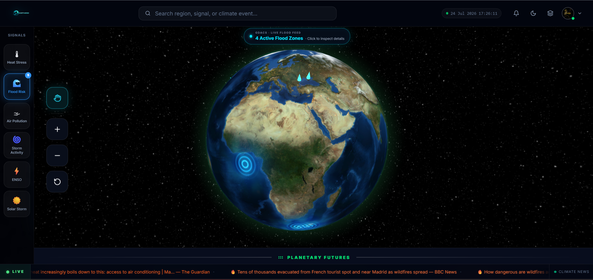
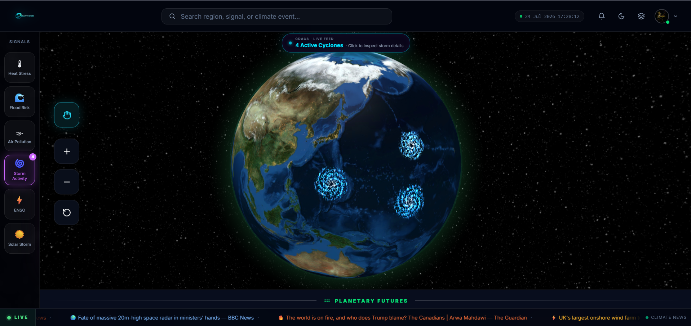
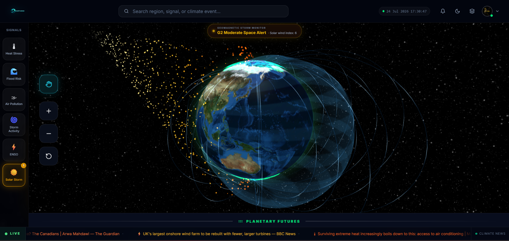
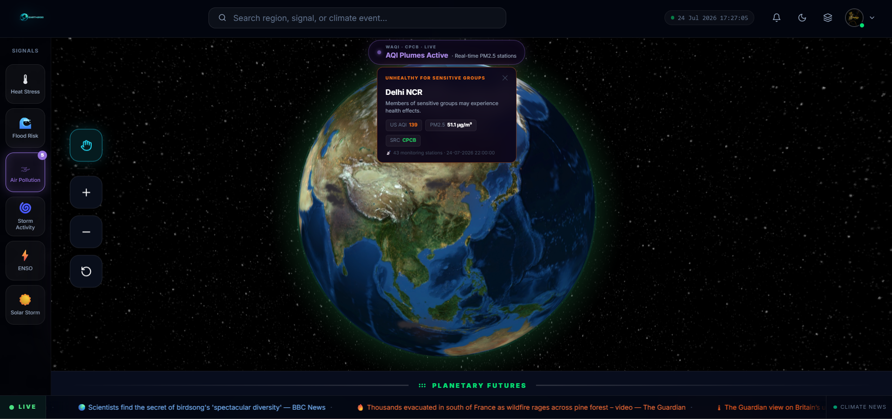
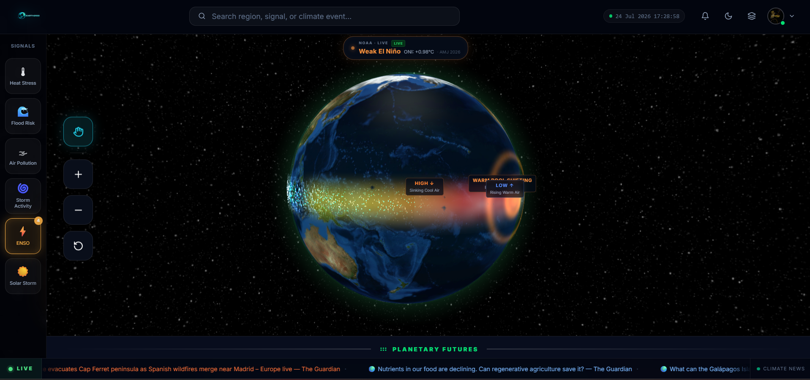
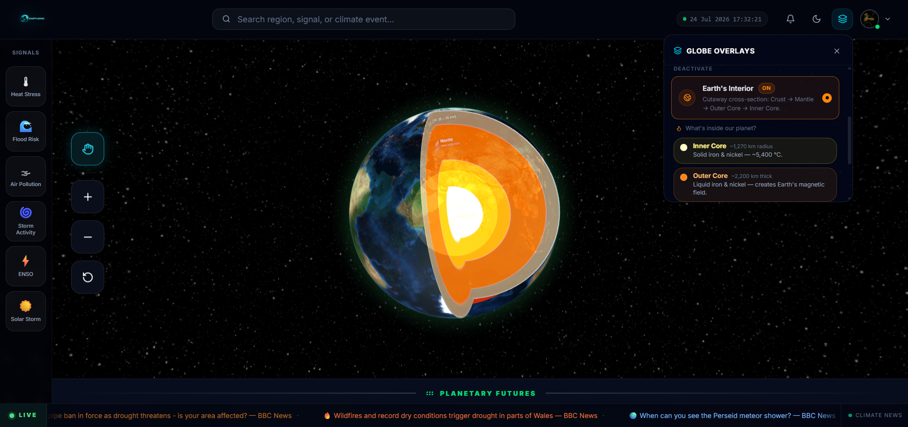
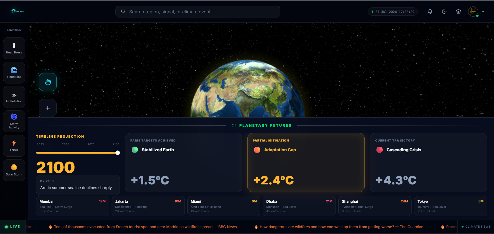

# 🌍 Earth 2100 — Climate Intelligence Platform

<div align="center">

  

  <p><b>An interactive 3D Earth intelligence platform visualizing real-world climate signals, live disaster alerts, regional hotspots, and planetary future scenarios (2025–2100).</b></p>

  [](https://react.dev/)
  [](https://vitejs.dev/)
  [](https://threejs.org/)
  [](https://nodejs.org/)
  [](https://expressjs.com/)
  [](LICENSE)

</div>

---

## 📸 Visual Showcase & Demo Gallery

> [!NOTE]  
> Below are designated spaces for platform feature screenshots and recordings. Place your image files in the `docs/images/` folder or replace the image paths below.

### 🌐 1. Default Earth View (3D Globe)
*Photorealistic WebGL globe with high-resolution NASA Blue Marble textures, bump-mapped topology, city night lights, and atmospheric cloud shells.*

```markdown

```
<div align="center">
  <!-- Replace with actual image path when available -->
  
</div>

---

### 🔴 2. Real-Time Climate Signals & Visualizations
*Custom GLSL shaders and particle systems rendering live disaster feeds (GDACS, WAQI, NASA GIBS).*

<table width="100%">
  <tr>
    <td width="50%" align="center">
      <b>🔥 Heat Stress & Temperature Gradient</b><br/><br/>
      
      <br/><sub>Latitude-based thermal gradient with FBM noise turbulence</sub>
    </td>
    <td width="50%" align="center">
      <b>🌊 Flood Risk & Inundation Beams</b><br/><br/>
      
      <br/><sub>Real-time GDACS flood events with 3D light beacons</sub>
    </td>
  </tr>
  <tr>
    <td width="50%" align="center">
      <b>🌀 Tropical Cyclones & Storm Basins</b><br/><br/>
      
      <br/><sub>Spinning 3-arm spiral particle vortices & rain bands</sub>
    </td>
    <td width="50%" align="center">
      <b>⚡ Solar Storms & Magnetosphere</b><br/><br/>
      
      <br/><sub>Coronal mass ejections, magnetic shield & polar auroras</sub>
    </td>
  </tr>
  <tr>
    <td width="50%" align="center">
      <b>🏭 Air Pollution & Smog Domes</b><br/><br/>
      
      <br/><sub>WAQI / CPCB live PM2.5 monitoring and toxic haze domes</sub>
    </td>
    <td width="50%" align="center">
      <b>🌊 ENSO / El Niño Oscillation</b><br/><br/>
      
      <br/><sub>Equatorial Pacific warm currents and animated arc flow streams</sub>
    </td>
  </tr>
</table>

---

### 🎛️ 3. Layers & Control Panel
*Interactive layer manager allowing users to toggle visual overlays, adjust signal intensity (0–100%), and filter climate telemetry.*

```markdown

```
<div align="center">
  
</div>

---

### 🔭 4. Planetary Futures Timeline (2025 → 2100)
*Scrub through IPCC-aligned environmental scenarios and observe real-time planetary transformations in sea level rise, ice coverage, and thermal stress.*

```markdown

```
<div align="center">
  
</div>

---

### 📍 5. Regional Hotspot Inspector & Live Telemetry
*Click any regional pin or event marker to fly the camera to the coordinate, opening a detailed cybernetic telemetry sidebar with historical trends and live sensor metrics.*

```markdown

```
<div align="center">
  
</div>

---

## ✨ Features Breakdown

### 🌐 3D Interactive WebGL Globe
* **Photorealistic Rendering**: Uses high-resolution NASA Earth imagery with topology bump mapping.
* **Dynamic Lighting & Night Shell**: City light overlays automatically illuminate on the dark side of the globe.
* **Smooth Camera Navigation**: Click-to-fly orbital camera controls with automatic rotation and drag-to-pause logic.

### 🔴 Real-Time Climate Signals
* **Flood Risk**: Live GDACS feed (`EVENTS4APP`) integration displaying active flood disaster locations with 3D light beacons, expansion shock rings, and Open-Meteo precipitation stats.
* **Storm Activity**: Real-time tracking of tropical cyclones and hurricanes from GDACS, rendered with 3-arm spiral particle systems and storm eyewalls.
* **Solar Storms & Space Weather**: Interactive solar flare intensity scrubber simulating coronal mass ejections, magnetic field line deflections, and polar auroral ovals.
* **Air Pollution**: Multi-tier live AQI integration fetching real-time PM2.5 and pollutant data from **WAQI** (World Air Quality Index) and **CPCB** (India Ministry of Environment).
* **ENSO / El Niño Oscillation**: Animated Pacific equatorial ocean current streams, sea surface temperature anomalies, and atmospheric circulation dynamics.

### 🔭 Planetary Futures Timeline (2025 – 2100)
Scrub from year 2025 to 2100 across three IPCC climate projection pathways:
* 🟢 **Stabilized Earth (+1.5°C)**: Paris targets met; controlled sea level rise (+0.3m), polar ice loss capped at 40%.
* 🟠 **Adaptation Gap (+2.4°C)**: Partial mitigation; moderate coastal inundation (+0.6m), ice loss at 65%.
* 🔴 **Cascading Crisis (+4.3°C)**: Current emissions trajectory; catastrophic flooding (+1.2m), ice loss reaching 85-90%.

---

## 🛠 Tech Stack

| Domain | Technologies Used |
|---|---|
| **Frontend Core** | React 18, Vite 5, JavaScript (ESNext) |
| **3D & Shaders** | Three.js (r184), `react-globe.gl`, Custom GLSL ShaderMaterials |
| **State & Animation** | Zustand v5, Framer Motion v11 |
| **UI & Styling** | Tailwind CSS v4, Lucide React, Recharts |
| **Backend API** | Node.js, Express.js, Firebase Admin SDK |
| **Data Sources** | GDACS API, WAQI API, Open-Meteo API, NASA GIBS & GPM IMERG |

---

## 📁 Repository Structure

```
Earth 2100/
├── client/                      # Frontend React + Vite Application
│   ├── public/                  # Static assets & logo.png
│   ├── src/
│   │   ├── components/
│   │   │   ├── Globe/           # WebGL Globe, Shaders, & Signal Layers
│   │   │   │   ├── AirPollutionLayer/  # Live WAQI/CPCB Smog Domes
│   │   │   │   ├── FloodLayer/         # Live GDACS Flood Beams & Ripples
│   │   │   │   ├── StormLayer/         # Live GDACS Cyclones & Eyewalls
│   │   │   │   ├── SolarStormLayer/    # Solar Flares & Magnetic Shield
│   │   │   │   ├── HeatMapLayer.jsx    # GLSL Thermal Shader
│   │   │   │   └── TimelineLayers/     # Ice, Sea Level & Forest Transitions
│   │   │   ├── Sidebar/         # Regional Hotspot Inspector
│   │   │   ├── Topbar/          # Header Navigation & Branding
│   │   │   ├── Layers/          # Layer Manager & Signal Toggles
│   │   │   └── Futures/         # Planetary Futures Timeline Drawer
│   │   ├── store/               # Zustand Global Stores
│   │   └── config/              # API and Environment Configuration
│   ├── geojson/                 # GeoJSON World Boundaries (240+ countries)
│   └── package.json
│
├── server/                      # Backend Node.js + Express REST API
│   ├── src/
│   │   ├── controllers/         # Hotspot & Notification Controllers
│   │   ├── routes/              # Express API Endpoint Routes
│   │   └── app.js               # Express Application Setup
│   └── package.json
│
├── docs/                        # Screenshots & Documentation Assets
│   └── images/                  # Place demo screenshots here
└── README.md                    # Root Documentation
```

---

## 🚀 Getting Started

### Prerequisites
* **Node.js** >= 18.x
* **npm** or **bun** / **yarn**

### 1. Installation

Clone the repository:
```bash
git clone https://github.com/Dubey411/Earth2100.git
cd Earth2100
```

### 2. Client Setup & Run

```bash
cd client
npm install
npm run dev
```
The client app will launch at `http://localhost:5173`.

### 3. Server Setup & Run

In a separate terminal:
```bash
cd server
npm install
npm run dev
```
The backend API will run on `http://localhost:5000`.

---

## 📡 Live API Integrations

* **GDACS API**: `https://www.gdacs.org/gdacsapi/api/Events/geteventlist/EVENTS4APP`
* **WAQI (World Air Quality Index)**: `https://api.waqi.info/feed/`
* **Open-Meteo Weather**: `https://api.open-meteo.com/v1/forecast`
* **NASA GIBS WMS**: `https://gibs.earthdata.nasa.gov/wms/epsg4326/best/wms.cgi`

---

## 📄 License

Distributed under the **MIT License**. See `LICENSE` for more information.

---

<div align="center">
  <sub>Built for planetary awareness & climate intelligence. 🌐 <b>Earth 2100</b></sub>
</div>
